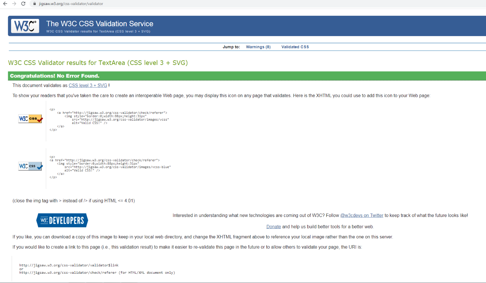

# Pokemon Fan Club

This project is designed to be a website for fans of the Pokemon world. This website will allow users
to find out more about the many different aspects of Pokemon such as the movies, animes and pokemon 
that make up the series. They can also subscribe to weekly newsletters as well as information on 
Pokemon fan events in their local area.

The main goal of the website is to offer an information resource for Pokemon fans, in order to receive 
as many visitors to the website as possible. Access to the website can be found 

[HERE] <<<<<<<<<<<<<<<<------------------------------------------------------->>>>>>>>>>>>>>>>

The goals of the website are as follows:

* To increase the popularity of Pokemon.
* Providing a visually appealing website.
* Representing different avenues for users to get invested into the Pokemon world.
* To provide well-trusted opinions of life-long Pokemon fans on the various games/movies/animes. 
* Increasing the popularity of people attending Pokemon fan events.
* Providing an accurate information source for the Pokemon community.

The goals of users are:

* To discover information on the movies/animes and which ones are rated best.
* Information on the many different games Pokemon offers.
* To discover fan events that are taking place in their local area.
* To be updated on the upcoming fan events that will be taking place in their local area. 

## UX

### Ideal Consumer

This website is aimed at users who:

* Hold an interest in Pokemon already.
* Have heard of Pokemon and want to find out more.
* Holds an interest in gaming, anime and watching movies.
* Want to be involved in the real-life Pokemon community.

Visitors to the website will be looking for:

* Information on the various aspects of Pokemon.
* Information on the fan events going on.

This project helps the consumer achieve this by:

* Providing a good user experience through clear design.
* Providing a visually appealing design.
* Providing the relevant information in a structured manner.

The following images are wireframes from each page of the website:

[HERE](https://www.figma.com/file/sB6i7Fs9u54Ef9U8r5x1lF/Pokemon-Fan-Club)

### Client Stories

* As a first time visitor I want a clear idea of what services the website is offering me.
* As a fan of Pokemon I want to be able to discover new pokemon I may never have heard of.
* As a new fan of Pokemon I want to discover new aspects of Pokemon I can involve myself in, such as movies or
animes I haven't yet come across.
* As a fan of Pokemon that wants to find like-minded people that share my passion for Pokemon I want to 
find out where local events are going on.

### Features

### Home

The home page contains an interactive navigation bar where users can hover over each link and have a hover effect, where
the text jumps and turns from blue to white. 

The home page also displays the very eye-catching Pokemon logo which, when the page loads will slide from the right in 
order to add to the environment of Pokemon where a common theme is to throw a pokeball. The background image is also 
every Pokemon of the original 151 facing the user, which adds to a welcoming theme, where the idea is to welcome users
to the fan club. 

### Pokedex

The pokedex feature allows users to sift through all of the Pokemon in the series using the PokeAPI. Users can select the name of a Pokemon and see the front and back image, the Pokemon's weight and height and the Pokemon's type. There were 
issues in terms of the responsivity of the Pokedex as the image of the Pokedex didn't respond well to smaller screen sizes.

Due to time constraints this issue was not resolved however in future changing the dimensions to percentages instead of rems 
could possibly work, or moving the right container to below the left container may also have been a solution.

### Games

The games section of the website takes users through a number of games of the Pokemon series. There is a hover feature on all of the images of the games. Game images are structured in a 3x3 rows and columns and are well spaced out to make room for the hover effect. 

When users click on an image they are met with a modal containing a slideshow of the relevant in-game screenshots as well as a Pokemon Fan Club star rating and review. 

### Anime

The anime section of the website contains a cdn from Swiper JS which allows users to swipe through a collection of animes that Pokemon have released. Each anime has a title, a star rating and the amount of episodes in the series. For users that are trying to watch the Pokemon anime this acts as a helpful tool as the information is displayed in a structured and chronological order.

### Movies

The movie section of the website displays a backdrop of a Pokemon movie as well as text content containing the movie name and a Pokemon Fan Club review. 

The image and text content automatically slide after 10 seconds giving users ample time to read the relevant information of the movie. There are also next and previous buttons for users to sift through the content to find a movie that appeals to them.

### newsletters

The newsletter section allows users to subscribe to a annual Pokemon magazine and a weekly newsletter which aims to detail when and where Pokemon events are occuring. This page has used the Emailjs functionality which allows for an email to be sent to the Pokemon Fan Club upon entering their details. Users will also receive an auto-reply from the Pokemon Fan Club. 

If users enter an invalid email address they will have an alert crop up on their screen and will be urged to enter a valid email.

### Features to Implement in the future

* Inclusion of the Pokedex into smaller screen sizes.
* Entering modals into the anime section where users can click on the anime image and receive more information.
* Fixing the issue in the modal section where some images were too big for certain screen sizes which would result in text moving up and down as the images changed.

### Technologies Used

* HTML, CSS & Javascript programming languages
* GitHUB – Used as an IDE by the developer.
* Google Fonts – Used to style the website fonts.
* Hover.css – Used for an underlining feature in the navigation bar for whenever a user hovers over a page link.
* Popper.js – Used to reference JavaScript.
* FontAwesome - Used icons for the arrows in the movie section and the stars for all the reviews.
* Swiper JS - Used for the anime section to slide between images.
* All images imported were downloaded from Google Images and then stored and linked by the developer.
* BootstrapCDN - Bootstrap 5 was used for the project’s structure and responsiveness.
* JSHint
* Figma - Used as a wireframing tool as my trial with Balsamiq.

## Testing

* [W3C HTML Code Validator](https://validator.w3.org/nu/?doc=https%3A%2F%2Fadamkcook94.github.io%2Fpokemon-fan-club%2F)

* W3C CSS Validator:

* JSHint:

When using JSHint, there were no errors but only warnings in terms of my usage of ES6 and a few missing semi-colons which have been fixed.

### Client Stories Testing

The common pathway for users throughout the website would be:

Home > Pokedex > Games > Anime > Movies > Newsletter

Each page contains relevant information that users will find helpful in their goal. Each page is structured in a simplistic yet effective way so as to not overwhelm users. 

As the website is structured in a one-page format users are unlikely to feel lost when delving into the website.

### Testing Client Stories

1. As a first time visitor I want a clear idea of what services the website is offering me.

i. The navigation bar is easy to use and clearly communicates what the website offers.

ii. As the website in a one-page format there are short trips to each page section. Users can quickly navigate from one page to the next.

2. As a fan of Pokemon I want to be able to discover new pokemon I may never have heard of.

i. The Pokedex section lists every single Pokemon in the Pokemon world.

ii. The Pokedex is clear and easy to use for all age groups with next and previous buttons being utilised to sift through the thousands of Pokemon on offer.

3. As a new fan of Pokemon I want to discover new aspects of Pokemon I can involve myself in, such as movies or
animes I haven't yet come across.

i. The Anime section houses every single anime in the Pokemon Universe for users to discover.

ii. The Anime section contains a personal, Pokemon Fan Club rating which comes from a trustable source.

iii. The movies section contains Pokemon movies for the user to discover.

iv. The movies section has a fluid autoplay enabling users enough time to read through each movies' plot.

4. As a fan of Pokemon that wants to find like-minded people that share my passion for Pokemon I want to 
find out where local events are going on.

i. The newsletter section allows users to enter their details into a sign up form where they will from then on receive weekly newsletters which contain information on fan events, as well as an annual magazine delivered to their doorstep.

### Manual Testing of all elements and functionality on every page.

#### Home

1. Navigation Bar:

i. Access the home page from a desktop.

ii. Right click and select “Inspect” to change screen size to that of a mobile device or tablet to confirm that the navigation bar is responsive.

iii. Hover over the menu items to make sure that text changes from blue to white and has a jumping effect.

iv. Click on each navigation menu item to confirm that that it links to the desired page and that it incorporates a scroll-down effect.

v. Change screen size to mobile and tablet devices and make sure the navigation bar links are still well spaced and easy to read.

vi. Change screen size to mobile and tablet devices and make sure the navigation bar links still function with a scroll-down effect.

2. Website Background Image:

i. Access the home page from a desktop.

ii. Change screen size to mobile and tablet devices to ensure the image scales depending on screen size.

3. Pokemon Logo 

i. Access the home page from a desktop.

ii. Change screen size to mobile and tablet devices to ensure the Pokemon Logo scales fluidly.

4. Welcome Message 

i. Access the home page from a desktop.

ii. Change screen size to mobile and tablet devices to ensure that the welcome message as well as the smaller images placed side by side scales fluidly. 

### Pokedex 

1. Background Image and title text

i. Ensure background image and title text re-format properly into smaller screen devices

2. Pokedex tool

i. Click the different Pokemon from the list to make sure the Pokedex shows a front and back image of a Pokemon, it's elemental type and it's height and weight.

ii. Click the "prev" and "next" buttons to ensure that the list of Pokemon changes to the next page.

iii. Change screen size to mobile and tablet devices. I was unable to properly make the pokedex responsive due to time constraints however as referenced in the 'future implementations' section this is an area to be improved upon.

iv. Ensuring that a message comes up to users informing them that the Pokedex is not suitable at screen sizes under 820px.

### Games 

1. Background Image and title text

i. Ensure background image and title text re-format properly into smaller screen devices

2. Game Images 

i. Ensure that they maintain a 3x3 structure at all screen sizes.

ii. Ensure that they maintain their aspect ratios at all screen sizes.

iii. Hovering over each image to ensure that each image retains its' hover effect.

iv. Clicking each image to ensure a modal pop up arrives. 

v. Changing screen sizes to mobile and tablet devices to ensure clicking on an image brings up a modal.

3. Modals 

i. Clicking on each image to make sure a modal comes up.

ii. Clicking each game image to make sure each game's modal has a functioning slideshow.

iii. Clicking each game image to ensure that users have the option of either clicking on an x button at the top of the modal or clicking outside of the modal to exit the modal.

iv. Changing screen size to mobile and tablet devices to ensure each modal retains a fluid structure as well as displaying the functionality mentioned previously.

### Anime

1. Swiper JS 

i. Swiping through each image one by one to ensure they all swipe through seamlessly and that the star rating, anime title and episode text is structured well.

ii. Converting screen size to mobile and tablet devices to ensure the swiper still works and the structure remains.

### Movies 

1. Movie Images & Textual Information 

i. Waiting throughout the autoplay feature to ensure that the text and text box maintains a fluid structure.

ii. Waiting throughout the autoplay feature to ensure that images slide through seamlessly.

iii. Changing screen size to mobile and tablet devices to ensure the text and text box maintains a good structure.

2. Arrow buttons 

i. Hovering over both the right and left arrows to ensure they change color when hovering over them.

ii. Clicking each arrow to ensure they both go to the next and previous slide.

iii. Clicking the next arrow at the last slide to ensure it loops back to the first slide.

iv. Clicking the previous arrow at the first slide to ensure it loops back to the last slide.

v. Waiting 8 seconds to click a next arrow to make sure the autoplay feature resets and slides again after a further 10 seconds, as opposed to always sliding after 10 seconds.

vi. Changing screen size to mobile and tablet devices to ensure arrows do not overlay the text and text box.

### Newsletter 

1. Sign Up Text Boxes

i. Clicking each text box to ensure each input element is working properly and you are able to enter relevant information.

ii. Re-sizing the screen to mobile and tablet devices to ensure text boxes scale fluidly.

2. Email JS functionality

i. Entering the correct information into the sign up form with a valid email and then clicking the 'subscribe' button. Then checking my email to ensure the EmailJS functionality is working as I have received an email from the Pokemon Fan Club.

ii. Entering an incorrect email address to ensure that a 'invalid email address' notification comes up.

3. Subscribe button

i. Ensuring that when you click the subscribe button a function carries out. 

ii. Hovering over the button to ensure a hover effect occurs.

## Further Testing:

Checked website on different devices to test functionality and no issues were found. Due to a significant knowledge gap Jasmine testing was not incorporated into this project.

## Deployment

This project was developed using GitPod, committed to git and pushed to GitHub.

To deploy this page, the following steps were taken:

1. Log into Github.
2. On GitHub, navigate to the repository “adamkcook94/pokemon-fan-club”.
3. Underneath the repository name, select “Settings”.
4. Scroll down to “GitHub Pages”.
5. Click on the drop-down menu and select “master”.
6. Click “save”.
7. The page will now refresh and a link to the site will be available under the “GitHub Pages” section.

## How to run this project locally

To clone this project from GitHub:

1. Click this link to the main page of the repository: https://github.com/adamkcook94/pokemon-fan-club
2. Above the list of files click “Code”.
3. Click “Open with GitHub Desktop”.
4. Follow the prompts in GitHub Desktop to complete the clone.

## Credits

- PokeAPI
- Pokemon

## Media

- The images used throughout the project were taken from Google Images, by way of the Pokemon series.

## Acknowledgements

- My inspiration for this project was found in my love for Pokemon.
- I would like to thank my tutor Narender for helping me throughout various aspects in this project.

  
